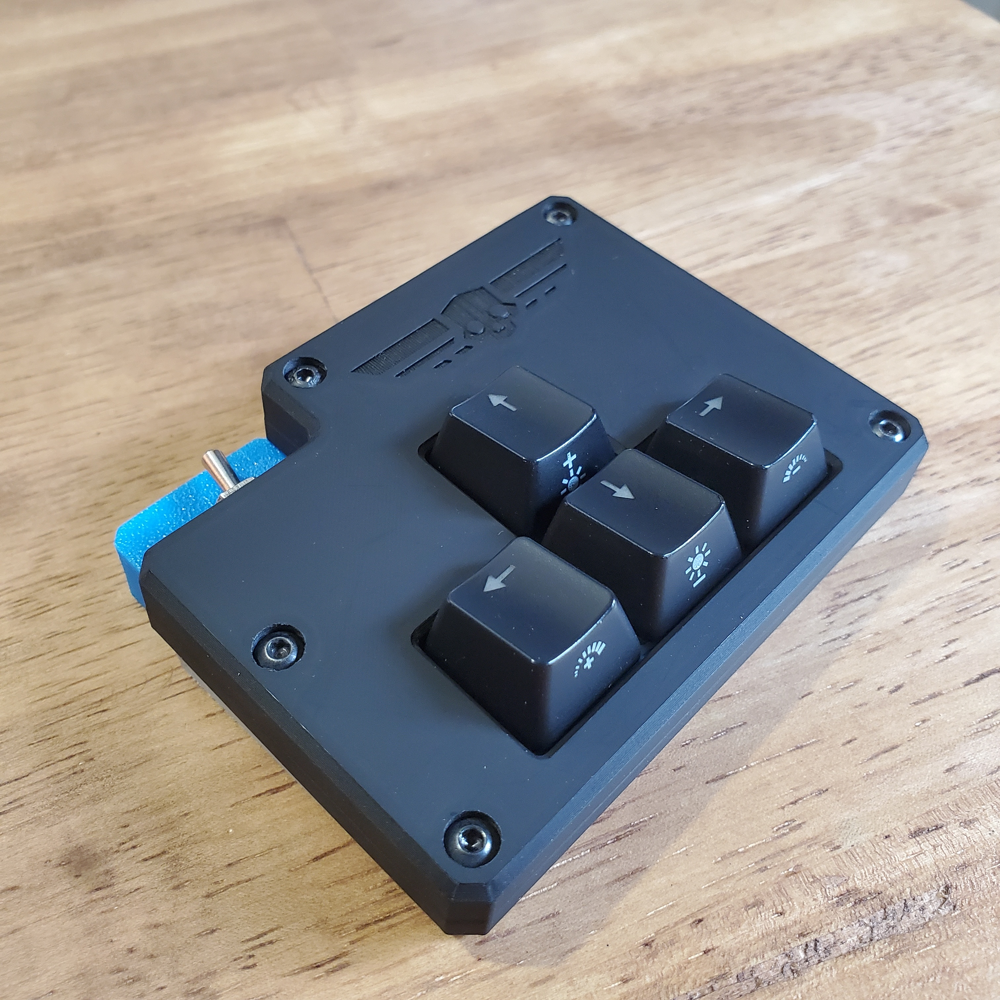

# Liberty Pad

## Greetings, Fellow Helldiver! 🫡

**FOR SUPER EARTH! FOR DEMOCRACY! FOR MANAGED DEMOCRACY!**

Listen up, soldier! Are you tired of fumbling with your keyboard like a rookie during intense Galactic War operations? Sick of missing those crucial stratagem inputs while bugs are crawling up your six? Well, your problems are over!

Introducing the **Liberty Pad** - a specialized macropad engineered by patriots, for patriots. This isn't just any ordinary input device; this is a precision instrument of democratic justice designed specifically for Helldivers who demand excellence in their stratagem deployment.

## What Makes This Pad So Liberating?

This beautiful piece of Super Earth engineering features exactly what every Helldiver needs:
- **Arrow Up** ⬆️ - For calling in those sweet, sweet reinforcements
- **Arrow Left** ⬅️ - Democracy moves in all directions
- **Arrow Right** ➡️ - Liberty knows no bounds  
- **Arrow Down** ⬇️ - Sometimes you need to get tactical
- **Power On/Off Switch** 🔘 - Because even freedom needs its rest between missions

That's it. No unnecessary bells and whistles. No confusing extra buttons that might cause you to accidentally call in an orbital strike on your own position (we've all been there). Just pure, concentrated freedom in a compact, power-efficient form.

**But here's where the real Super Earth engineering shines:** Each directional input uses cutting-edge **Hall Effect magnetic sensors** - these analog magnetic marvels provide ultra-precise, lightning-fast response with rapid trigger activation. Perfect for those split-second stratagem inputs when every millisecond counts in the heat of battle. Just pure, magnetic democracy at your fingertips! 🧲

Built on the robust ESP32-C6 platform, this pad delivers liberty wirelessly through advanced Bluetooth technology - because true democracy knows no cables! Whether you're diving from orbit or taking cover behind a rock, your Liberty Pad maintains that crucial wireless connection to ensure your stratagems reach Super Earth's fleet without interference.

## Want to Build Your Own Freedom Dispenser?

Check out the CAD design and start spreading democracy one keypress at a time:
🔗 [Liberty Pad on Onshape](https://cad.onshape.com/documents/389e0bcc3c505edd569c1aed/w/36b9f93d7408bdc73c1e3cee/e/039947f1c39faf23b9bdd7ae)

Remember, Helldiver: "A citizen who contributes to Super Earth's technological advancement is a citizen who contributes to the preservation of our way of life."

**Now drop, deploy, and deliver democracy!**

---